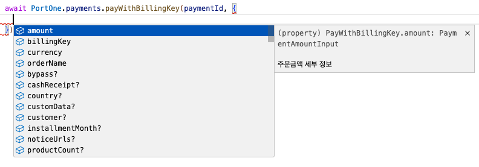
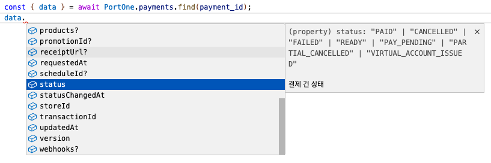

# PortOne REST API V2

- [PortOne 개발자센터 - REST API V2](https://developers.portone.io/api/rest-v2?v=v2)

포트원 API V2의 request, response 타입에 대한 자동완성을 모두 지원합니다.



단, 공식문서상 UNSTABLE로 표기된 API들은 지원하지 않습니다.
- 결제 대용량 다건 조회(커서기반)
- B2B 서비스 API

## Usage

### API Client 초기화
```ts
import { PortOne } from 'portone-api-v2';

const portone = new PortOne({
    // (Required) PortOne V2 API Secret
    apiSecret: process.env.PORTONE_API_SECRET,

    // (Optional) axios 인스턴스 커스터마이징
    validateStatus: (status: number) => true,  // 예시
    timeout: 5000,  // 예시
    baseURL: 'https://test.portone.io', // 기본값: 'https://api.portone.io'
});
```

### 정기결제 예시
```ts
const { data: { billingKeyInfo } } = await portone.billingkey.issue({
    channelKey: 'channel-key',
    method: {
        card: {
            credential: {
                number: '1234-1234-1234-1234',
                expiryMonth: '02',
                expiryYear: '28',
            }
        }
    },
});

const { billingKey } = billingKeyInfo;
await portone.payments.payWithBillingKey('payment-id', {
    billingKey,
    orderName: '주문명',
    amount: {
        total: 10000,
    },
    currency: 'KRW',
    noticeUrls: ['https://my-service.com/api/payments/callback'],
});
```

### 웹훅 스케줄링 예시
```ts
app.post('/payments/callback', async (req, res) => {
    const { payment_id }: PaymentWebhookCallbackBody = req.body;
    const { data: payment } = await portone.payments.find(payment_id);

    // 실결제 내역 대조

    const paymentId = 'next-payment-id';
    await portone.schedules.nextPayment(paymentId, {
        timeToPay: new Date(Date.now() + 1000 * 60 * 60 * 24 * 30).toISOString(),
        payment: {
            orderName: payment.orderName,
            billingKey: payment.billingKey,
            amount: payment.amount,
            currency: payment.currency,
        },
    });
});
```

last updated: 2024-04-13 (works with [`@portone/browser-sdk@0.0.5`](https://www.npmjs.com/package/@portone/browser-sdk?activeTab=readme))